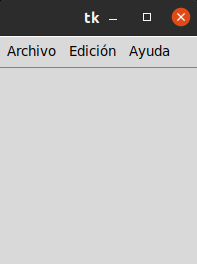

# 3 POSICIONAMIENTO Y DISEÑO DE BOTONES

## BUTTON (cronometro)
### En este button en realidad es un cronometro que si le das clik en el boton de iniciar empieza a contar y si le das clik en canselar se detiene 

## ENTRY (Login)
### En este caso es un login o una pagina para acceder a llenar datos (personales)

## label (reloj)
### En el label es un reloj que esta programado para decirnos la hora.

## LISTBOX (Traductor)
### En este caso traduce una palabra "Hola" en diferentes idiomas pero esto nos puede ayudar a prender a como se traduce en otros idiomas.  

## MENUBUTTON (formulario)
### En este caso este formulario trae direccion o genero y edad etc

## OPTIONMENU (FORMULARIO_2)
### En este caso ya el formulario no trae genero pero trae las cosas las mismas casillas de arriba 

## SCALE ARCO (ARCO)
### Este es  un arco para medir angulos hasta de 360 grados 

## SPINBOX (direccion)
### En este trae lo mismo que el formulario 2

## TROPLEVEL (acceder)
### En este caso hay un button para acceder

## VARABLES (letrero deslizante)
### En este caso es un letrero deslizante con una frace que va de izquiera a derecha repitiendo el mismo procedimiento.

## MENU 
### Este menu tiene unos button para escribir (pegar,copiar,cortar,borrar etc. ) tambien tiene para guardar todo los archivos.

## TEXT
### Este text es como la interfas de una pagina que trae button para guardar archivos y para copiar y pegar.
